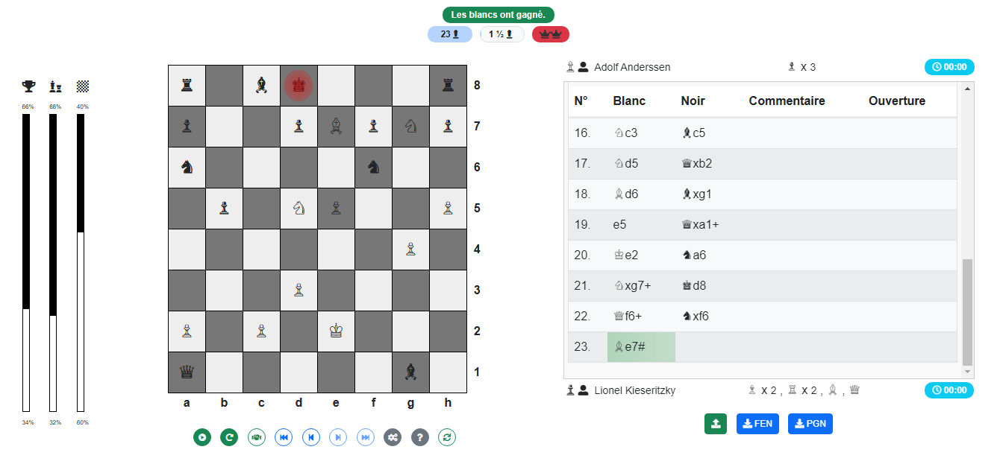

# **checkmat.js**

CheckMat.js est une bibliothèque JavaScript complète et autonome dédiée à l'affichage, la manipulation, et l'interaction avec des jeux d'échecs. Cette bibliothèque est conçue pour être flexible, intuitive et facilement intégrable dans tout projet web.

---

## **Fonctionnalités principales**

- **Échiquier interactif :**
  - Création d'un échiquier complet avec gestion des pièces, surbrillances dynamiques et interactions utilisateur (glisser-déposer, highlights).
  - Notifications visuelles pour les situations telles que l'échec, le mat et les mouvements invalides.
- **Validation des règles :**
  - Support étendu des règles du jeu d'échecs, incluant :
    - Le roque (grand et petit).
    - La prise en passant.
    - Les promotions différées et directes.
    - Vérification des positions pour échec et mat, pat, et répétition des positions.
- **Notations standard :**
  - Génération et lecture des notations PGN et FEN avec support des cas complexes.
- **Analyse stratégique :**
  - Intégration de tables d'évaluation pour chaque type de pièce afin d'améliorer l'analyse positionnelle.
  - Calculs dynamiques des scores de position et de matériel.
- **Gestion des parties :**
  - Suivi détaillé de l'historique des coups avec annulation et restauration.
  - Import/export des parties via les notations PGN et FEN.
- **Personnalisation :**
  - Apparence configurable, gestion des événements et règles personnalisables.
- **Conception modulaire :**
  - Architecture modulaire facilitant l'extension et l'intégration.

---

## **L'interface**



---

## **Démo en ligne**

Testez CheckMat.js directement ici :  
➡️ [https://checkmat.timecaps.fr/](https://checkmat.timecaps.fr/)

---

## **Installation**

### 1. Téléchargement
Clonez le dépôt GitHub pour obtenir les fichiers source :
```bash
git clone [https://github.com/votre-utilisateur/checkmat.js.git](https://github.com/moobotec/checkmate.js.git)
```

### 2. Inclusion dans le projet
Ajoutez les fichiers nécessaires à votre projet web. checkmat.js dépend de jQuery pour certaines fonctionnalités interactives :

```html
<!-- Inclure les fichiers de CheckMat.js -->
<link rel="stylesheet" href="checkmat.css">
<script type="module" src="checkmat.js"></script>
```

### 3. Styles personnalisés

Le fichier CSS `checkmat.css` personnalise l'apparence du module.

### 4. Dépendances

- [jQuery](https://jquery.com) (3.5.1+)
- [Bootstrap](https://getbootstrap.com) (4.5.2+)
- [Font Awesome](https://fontawesome.com) pour des icônes élégantes.

---

## **Utilisation**

1. Ajoutez un conteneur HTML pour l'échiquier :
   ```html
   <div id="checkmatContainer"></div>
   ```
2. Initialisez le plugin avec jQuery :
   ```javascript
   $(document).ready(function() {
       $('#checkmatContainer').checkmatBuilder({});
   });
   ```

---

## **Changelog**

### **v0.0.2**
- **Ajout :** 
  - `evaluation-engine.js` pour l'analyse positionnelle avancée.
- **Améliorations majeures :**
  - Gestion des promotions différées et directes.
  - Suivi détaillé des positions pour éviter les répétitions.
  - Génération enrichie de notations FEN et PGN.
  - Notifications visuelles pour les échecs et les mats.
- **Corrections et optimisations diverses.**

---

## **Licence**

Ce projet est sous licence MIT. Consultez le fichier [LICENSE](LICENSE) pour plus de détails.

---
